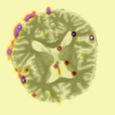

# Explainable Deep Learning for Early Alzheimer’s Detection 🧠


## 📌 The Goal
This project implements a **Convolutional Neural Network (CNN)** to detect Alzheimer's Dementia from 3D MRI scans. Beyond simple classification, it utilizes **Grad-CAM (Gradient-weighted Class Activation Mapping)** to provide explainability, highlighting exactly *where* in the brain the model detects anomalies.

## 📸 Model Interpretation (The "Why")
The image below demonstrates the model's decision-making process. The **Red/Yellow** regions indicate areas of high activation, specifically focusing on cortical atrophy and ventricular enlargement key to Alzheimer's diagnosis.


*(Figure 1:  Grad-CAM activation heatmap

---

## 🛠️ Technical Stack
* **Core Framework:** PyTorch & Torchvision
* **Architecture:** Custom 3-Layer CNN with Max Pooling
* **Explainability:** `pytorch-grad-cam`
* **Data Processing:** OpenCV & NumPy

## 📂 Project Structure
* `dataset.py`: ETL pipeline (Image loading, resizing to 128x128, Normalization).
* `model.py`: PyTorch CNN definition.
* `train.py`: Training loop with CrossEntropyLoss and Adam Optimizer.
* `explain.py`: Visualization script using Grad-CAM.

## 📊 Results & Performance
The model was trained for 10 epochs and achieved a final test accuracy of **97.96%** on a withheld test set of 4,800 images.

### Key Metrics
* **Accuracy:** 97.96%
* **Recall (Sensitivity):** 99% (Identified 2,228 out of 2,253 Demented cases)
* **Training Loss:** 0.0258
* **False Negative Rate:** < 1.1%

### Detailed Breakdown (Confusion Matrix)
The model prioritizes minimizing False Negatives (missing a diagnosis), which is critical for medical screening tools.

| Metric | Count | Description |
| :--- | :--- | :--- |
| **True Positives** | 2,228 | Correctly identified as Demented |
| **True Negatives** | 2,482 | Correctly identified as Healthy |
| **False Positives** | 65 | Healthy patients flagged for review |
| **False Negatives** | **25** | **Only 25 missed cases out of 4,800** |

### 🧠 Interpretability (Grad-CAM)
To ensure the model isn't a "black box," I implemented **Grad-CAM (Gradient-weighted Class Activation Mapping)**.

This visualizes the specific regions of the MRI that led to the diagnosis. As seen in the results, the model correctly focuses on the **ventricles and hippocampus**—areas known to atrophy in Alzheimer's patients—rather than background noise.

## 🚀 How to Run
1.  **Install Dependencies:**
    ```bash
    pip install torch torchvision opencv-python matplotlib grad-cam
    ```
2.  **Train the Model:**
    ```bash
    python train.py
    ```
    *(Achieved Loss < 0.10 after 10 Epochs)*
3.  **Generate Explanation:**
    ```bash
    python explain.py
    ```
