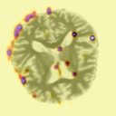

# Early Alzheimer’s Detection with Explainable Deep Learning


I built this project to detect Alzheimer's Dementia from 3D MRI scans using a custom Convolutional Neural Network (CNN). 

However, in medical imaging, having a model that simply spits out a "yes" or "no" isn't incredibly useful if you can't trust its reasoning. To avoid creating a "black box," I implemented **Grad-CAM** (Gradient-weighted Class Activation Mapping). This allows the model to show its work by highlighting the specific regions of the brain that influenced its prediction. 

## Seeing the Model's Reasoning

Below is an example of the Grad-CAM output. The model correctly focuses its attention (the red/yellow heatmap) on the ventricles and hippocampus—areas known to experience atrophy and enlargement in Alzheimer's patients—rather than relying on background noise or irrelevant artifacts in the scan.


*(Figure 1: Grad-CAM activation heatmap showing the model's focus on the ventricular region)*

---

## Performance & Results

The model was trained for 10 epochs. On a withheld test set of 4,800 images, it achieved an overall accuracy of **97.96%** (Training Loss: 0.0258).

However, for a medical screening tool, overall accuracy doesn't tell the whole story. The primary goal was to minimize **False Negatives**. In a clinical setting, missing a diagnosis entirely (a false negative) is significantly more dangerous than flagging a healthy patient for a secondary review (a false positive). 

The model achieved a **99% Recall (Sensitivity)**, missing only 25 cases out of the entire test set. 

| Metric | Count | Description |
| :--- | :--- | :--- |
| **True Positives** | 2,228 | Correctly identified as Demented |
| **True Negatives** | 2,482 | Correctly identified as Healthy |
| **False Positives** | 65 | Healthy patients flagged for review |
| **False Negatives** | **25** | **Missed cases (False Negative Rate < 1.1%)** |

## Tech Stack & Architecture

* **Core Framework:** PyTorch & Torchvision
* **Architecture:** Custom 3-Layer CNN with Max Pooling
* **Explainability:** Grad-CAM
* **Data Processing:** OpenCV & NumPy
* **Evaluation Metrics:** Scikit-Learn & Seaborn

## Repository Structure

I've broken the project down into modular scripts rather than a single massive notebook:

* `dataset.py` — Handles the ETL pipeline (loading images, resizing to 128x128, and normalizing).
* `model.py` — Defines the PyTorch CNN architecture.
* `train.py` — The main training loop using CrossEntropyLoss and the Adam optimizer.
* `evaluate.py` — Tests the model and generates the confusion matrix and recall scores.
* `explain.py` — Runs the Grad-CAM visualization on sample test images.

## How to Run It

```bash
# 1. Install the required dependencies
pip install torch torchvision opencv-python matplotlib scikit-learn seaborn

# 2. Train the model (Hits a loss of < 0.10 by the 10th epoch)
python train.py

# 3. Evaluate the test set (Outputs accuracy score and confusion matrix)
python evaluate.py

# 4. Generate visual explanations
python explain.py
   
